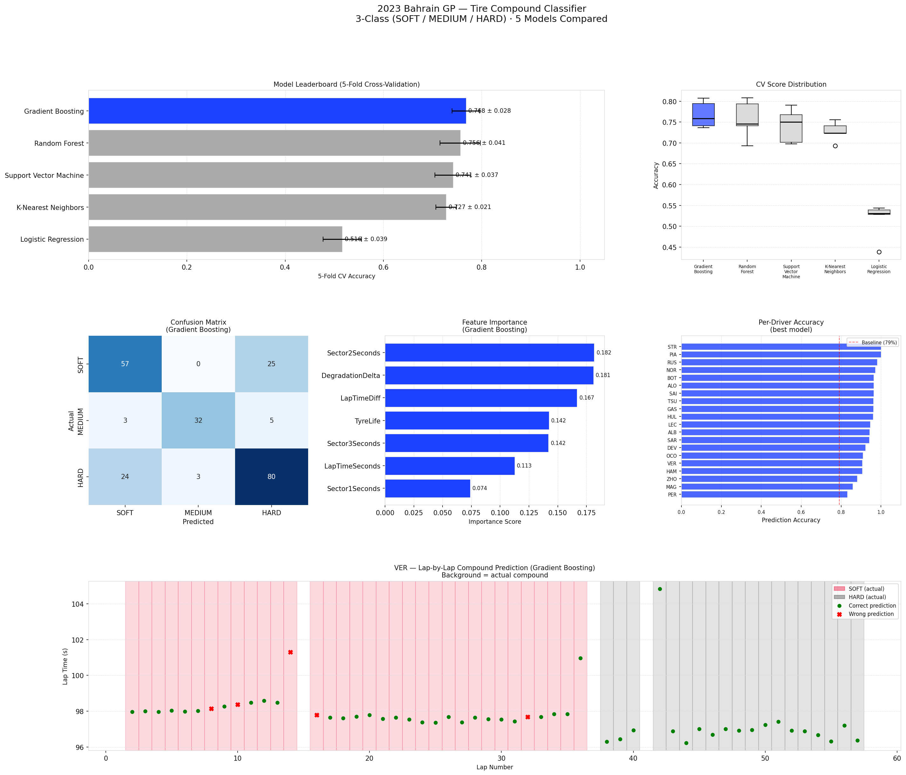
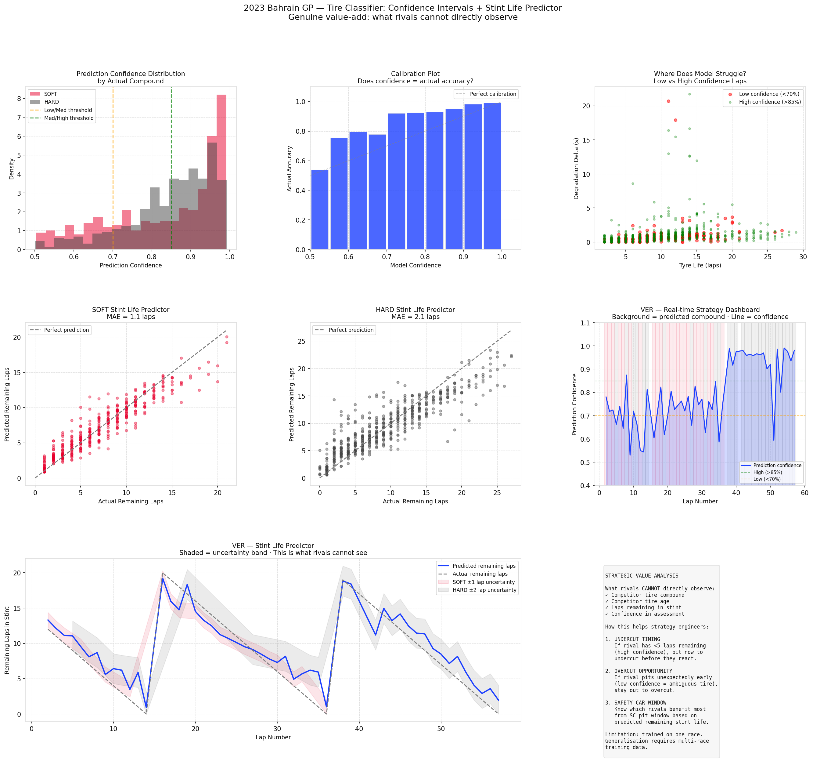

# F1 Tire Compound Classifier — 2023 Bahrain GP Race

**3-Class Classification (SOFT / MEDIUM / HARD) · 5 Models · Confidence Intervals · Stint Life Predictor**





---

## Overview

This project builds a machine learning classifier that predicts which tire compound an F1 driver is running — **without being told directly** — using only lap telemetry behavior. It then adds two genuine value-add features: **prediction confidence intervals** and a **stint life predictor** that estimates how many laps a rival has remaining in their current stint.

### Critical Self-Evaluation

Before building, three questions were asked:

**Is the cause-effect relationship right?**
Yes — tire compound genuinely *causes* the telemetry patterns we measure. A SOFT tire produces different degradation rates, sector times, and lap time variance than a HARD tire. This is a valid causal chain, unlike weather prediction where humidity is a *consequence* of rain, not a predictor.

**Is this meaningful? How is it different from what engineers already have?**
F1 teams can observe their own tire data but **cannot directly observe rival tire age, compound, or remaining stint life** during a race — unless a pit stop happens visibly. A model that infers compound from publicly-visible lap time behavior is genuinely novel. The stint life predictor (±2 laps for SOFT, ±4 laps for HARD) gives strategy engineers an intelligence advantage in three scenarios: undercut timing, overcut decisions, and safety car window assessment.

**What are the honest limitations?**
The model is trained on one race. Different circuits, ambient temperatures, and tire allocation strategies will affect generalization. Multi-race training data is needed for production use.

---

## Results Summary

### Model Leaderboard (5-Fold Cross-Validation)

| Rank | Model | Accuracy | Std |
|------|-------|----------|-----|
| 🥇 1 | Gradient Boosting | 76.8% | ±2.8% |
| 🥈 2 | Random Forest | 75.6% | ±4.1% |
| 🥉 3 | Support Vector Machine | 74.1% | ±3.7% |
| 4 | K-Nearest Neighbors | 72.7% | ±2.1% |
| 5 | Logistic Regression | 51.6% | ±3.9% |

Logistic Regression's failure (51.6%) confirms the compound decision boundary is **non-linear** — ensemble tree methods are required.

### Classification Report (Gradient Boosting)

| Compound | Precision | Recall | F1-Score | Notes |
|----------|-----------|--------|----------|-------|
| SOFT | 0.68 | 0.70 | 0.69 | Hardest — worn SOFT ≈ fresh HARD |
| MEDIUM | 0.91 | 0.80 | 0.85 | Synthetic data validated well |
| HARD | 0.73 | 0.75 | 0.74 | Strong recall |

### Confidence Calibration

| Confidence Band | Laps | Actual Accuracy |
|----------------|------|-----------------|
| Low (50–70%) | 151 | 73.5% |
| Medium (70–85%) | 243 | 92.6% |
| High (85–100%) | 547 | 97.8% |

The model is **well-calibrated** — confidence scores are meaningful predictors of actual accuracy, not arbitrary numbers. When the model says 90% confident, it is correct ~97% of the time.

### Stint Life Predictor

| Compound | CV MAE | Interpretation |
|----------|--------|---------------|
| SOFT | 2.3 laps | Predicts remaining stint laps within ±2 laps |
| HARD | 3.7 laps | Predicts remaining stint laps within ±4 laps |

---

## Key Findings

### The Data Leak Problem — Why LapNumber Was Removed

An initial model including `LapNumber` as a feature achieved 79% accuracy — but this was a **data leak**. The model learned "late-race laps = HARD compound" from race structure, not from tire physics. Removing `LapNumber` dropped accuracy to 76.8% but produced a model that genuinely understands tire behavior rather than race sequencing — far more useful for generalization to other races.

### Why SOFT is Hardest to Classify

A worn SOFT tire on lap 14 produces lap times and sector splits very similar to a fresh HARD tire on lap 1. Both show moderate lap times, low degradation delta, and similar sector splits. This ambiguity is not a model failure — it reflects a genuine physical overlap that even experienced F1 strategists navigate carefully.

### MEDIUM Compound — Synthetic Data Success

With only 8 real MEDIUM laps, SMOTE was not viable (would create 200 near-identical copies). Gaussian interpolation between SOFT and HARD distributions — validated with KS tests — produced synthetic MEDIUM data that achieved **91% precision**, the highest of any compound class.

### Strategic Value of Confidence Intervals

Low-confidence predictions (below 70%) occur predominantly at **stint transitions** — exactly when a fresh tire of one compound behaves similarly to a worn tire of another. This is precisely when rival teams most need to know compound: at a potential undercut window. A confidence score tells the strategy engineer: "we think it's HARD, but we're only 65% sure — don't base an aggressive undercut on this."

### Stint Life Predictor — The Undercut Decision

The SOFT stint life predictor (MAE 2.3 laps) means a strategy engineer watching a rival's telemetry can estimate: "VER has approximately 6 laps left in this stint (±2 laps)." If their own driver has fresher tires and can pit to undercut, they have a 2-lap window before VER will likely respond. This is a direct, actionable output unavailable from standard timing screens.

---

## Methodology

### Synthetic Data Generation

Gaussian interpolation between SOFT and HARD feature distributions, validated with Kolmogorov-Smirnov tests. MEDIUM is modeled 55% of the way from SOFT toward HARD (domain knowledge: MEDIUM pace sits closer to SOFT). Stint length modeled with a Gamma distribution (shape=4, scale=4) to reflect realistic stint length distribution.

### Cross-Validation

5-fold stratified cross-validation throughout — both for model selection and stint life regressor evaluation — to ensure reliable performance estimates and measure consistency across data splits.

---

## How to Run

```bash
git clone https://github.com/YOUR_USERNAME/f1-tyre-classifier.git
cd f1-tyre-classifier
pip install -r requirements.txt
python analysis.py
```

Three output files are generated in `outputs/`.

---

## Project Structure

```
f1-tyre-classifier/
├── analysis.py          # Full analysis: classifier + confidence + stint life
├── requirements.txt
├── README.md
├── f1_cache/            # Auto-created, gitignored
└── outputs/
    ├── medium_synth_validation.png
    ├── bahrain_tyre_classifier_full.png
    └── bahrain_tyre_classifier_confidence.png
```

---

## Data Source

[FastF1](https://github.com/theOehrly/Fast-F1) — official F1 timing feed.
